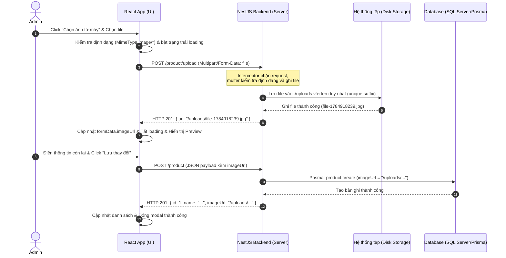

# Hướng Dẫn & Giải Thích Cơ Chế Upload Ảnh Sản Phẩm

Tài liệu này giải thích chi tiết cách thức hoạt động của tính năng tải ảnh từ máy tính (Local Image Upload) trong hệ thống e-commerce từ lúc người dùng chọn ảnh cho tới khi ảnh được lưu và hiển thị trên màn hình.

---

## 1. Sơ Đồ Quy Trình Hoạt Động (Sequence Diagram)

Dưới đây là luồng xử lý từ khi người dùng bấm chọn ảnh cho tới lúc lưu sản phẩm vào Database:



---

## 2. Chi Tiết Hoạt Động Tại Backend (NestJS)

### A. Tải ảnh lên và lưu trữ (`POST /product/upload`)
Được xử lý tại [product.controller.ts](file:///c:/Users/Admin/Documents/Project_CV/event-driven-ecommerce/backend/src/product/product.controller.ts):
- **`FileInterceptor('file', {...})`**: NestJS sử dụng thư viện Multer dưới dạng một Interceptor để trích xuất file từ request payload multipart/form-data.
- **`diskStorage`**:
  - **`destination`**: Cấu hình lưu file tạm thời/vĩnh viễn vào thư mục `./uploads` ở thư mục gốc của backend.
  - **`filename`**: Để tránh hiện tượng đè tệp tin khi trùng tên, tên tệp được đặt lại theo định dạng: 
    `[fieldname]-[timestamp_hiện_tại]-[số_ngẫu_nhiên].[đuôi_tệp_gốc]`
- **`fileFilter`**: Kiểm tra phần mở rộng của file. Chỉ chấp nhận các định dạng hình ảnh chuẩn như `.jpg, .jpeg, .png, .gif, .webp`. Nếu không đúng, ném ra một lỗi chặn luồng xử lý.
- **Đầu ra**: Trả về đường dẫn tương đối `/uploads/tên-file.jpg`. Việc trả về đường dẫn tương đối (không kèm domain `http://localhost:3000`) giúp cơ sở dữ liệu linh hoạt, không bị cứng domain khi deploy lên staging/production.

### B. Phục vụ file tĩnh (Static Asset Serving)
Được cấu hình trong [main.ts](file:///c:/Users/Admin/Documents/Project_CV/event-driven-ecommerce/backend/src/main.ts):
```typescript
const uploadsDir = join(__dirname, '..', 'uploads');
app.useStaticAssets(uploadsDir, { prefix: '/uploads/' });
```
- Khi NestJS biên dịch, file chạy nằm trong thư mục `dist/`. Đoạn code trên trỏ tới thư mục `uploads/` nằm ở ngoài thư mục `dist/`.
- Tiền tố `{ prefix: '/uploads/' }` thông báo cho Express rằng bất kỳ request nào bắt đầu bằng `http://localhost:3000/uploads/...` sẽ được khớp trực tiếp với các file trong thư mục `./uploads`.

---

## 3. Chi Tiết Hoạt Động Tại Frontend (React)

### A. Giao diện File Picker & Xem Trước (Preview)
Được xử lý tại [ProductAdmin.tsx](file:///c:/Users/Admin/Documents/Project_CV/event-driven-ecommerce/frontend/src/pages/AdminPage/ProductAdmin.tsx):
- Thẻ `<input type="file" accept="image/*" className="hidden" />` được ẩn đi. 
- Thay vào đó, ta hiển thị một nhãn `<label>` được CSS giống nút bấm hiện đại. Khi bấm nhãn này, trình duyệt sẽ tự động kích hoạt hộp thoại chọn file của hệ điều hành.
- Khi người dùng chọn file, sự kiện `handleFileChange` kích hoạt:
  1. Kiểm tra file trên client có đúng định dạng ảnh hay không (`file.type.startsWith("image/")`).
  2. Bật trạng thái `isUploading = true` để hiển thị spinner và khóa nút chọn ảnh (tránh bấm đúp).
  3. Gọi hàm `uploadProductImage(file)` gửi file lên server.
  4. Nhận kết quả URL tương đối và lưu vào `formData.imageUrl`.
  5. Khi `formData.imageUrl` có giá trị, giao diện React tự động render thẻ `` preview của tệp vừa tải lên, kèm nút "Thùng rác" để reset đường dẫn ảnh nếu muốn đổi ảnh khác.

### B. Hàm tiện ích hiển thị ảnh đa nguồn (`getImageUrl`)
Được định nghĩa tại [image.ts](file:///c:/Users/Admin/Documents/Project_CV/event-driven-ecommerce/frontend/src/utils/image.ts):
```typescript
export function getImageUrl(url: string | undefined): string {
  if (!url) return "";
  if (url.startsWith("http://") || url.startsWith("https://")) {
    return url; // 1. Link ngoài tuyệt đối
  }
  if (url.startsWith("/uploads/")) {
    return `http://localhost:3000${url}`; // 2. Link tải lên từ máy tính
  }
  return `/images/${url}`; // 3. Link ảnh mẫu sẵn có (mock/seed)
}
```
Mục đích của helper này là giúp giao diện người dùng hiển thị ảnh chuẩn xác trong mọi tình huống:
1. **Dữ liệu Seed cũ**: Trong DB lưu `https://example.com/...`, hàm sẽ giữ nguyên URL tuyệt đối này.
2. **Ảnh tĩnh Mock ở frontend**: Trình duyệt truy cập `/images/pizza.jpg` trên frontend dev server, hàm sẽ bổ sung tiền tố `/images/` cho ảnh tương đối.
3. **Ảnh upload thực tế từ backend**: Trả về `http://localhost:3000/uploads/file-xyz.jpg` trỏ thẳng tới server NestJS.

---

## 4. Cách Chạy Thử Nghiệm

1. Khởi chạy Backend: `npm run start:dev` (Cổng 3000)
2. Khởi chạy Frontend: `npm run dev` (Cổng 5173)
3. Truy cập vào trang Quản trị sản phẩm, mở Modal thêm sản phẩm mới.
4. Bấm chọn tệp ảnh và bạn sẽ thấy tệp ảnh tự động được tải lên backend và hiển thị xem trước tức thì!
